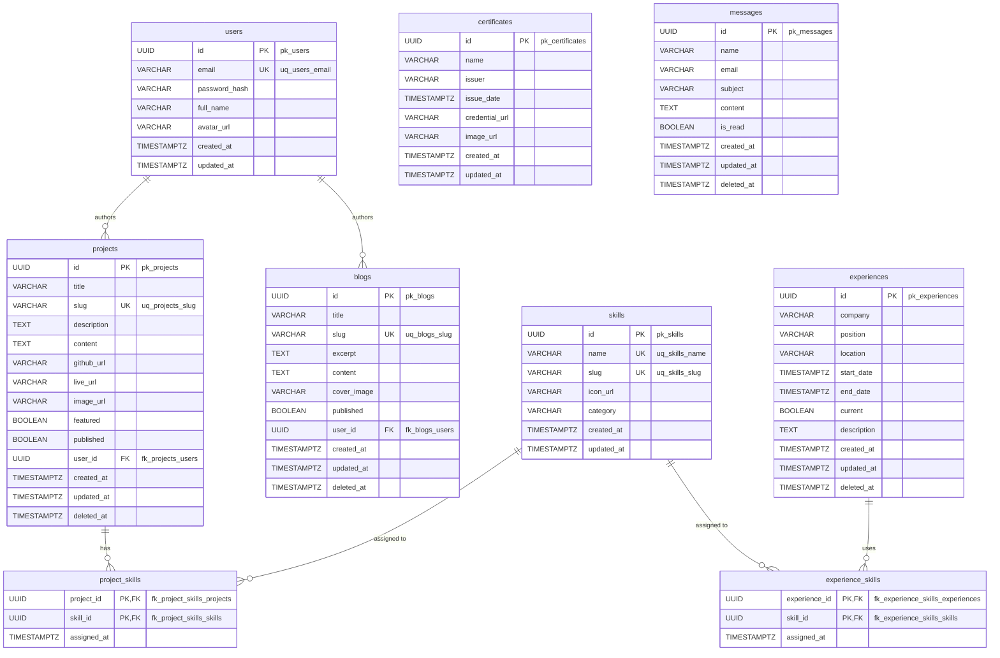

# Entity Relationship Diagram (ERD)

```mermaid
erDiagram
    users ||--o{ projects : "authors"
    users ||--o{ blogs : "authors"
    
    projects ||--o{ project_skills : "has"
    skills ||--o{ project_skills : "assigned to"
    
    experiences ||--o{ experience_skills : "uses"
    skills ||--o{ experience_skills : "assigned to"

    users {
        UUID id PK "pk_users"
        VARCHAR email UK "uq_users_email"
        VARCHAR password_hash
        VARCHAR full_name
        VARCHAR avatar_url
        TIMESTAMPTZ created_at
        TIMESTAMPTZ updated_at
    }

    projects {
        UUID id PK "pk_projects"
        VARCHAR title
        VARCHAR slug UK "uq_projects_slug"
        TEXT description
        TEXT content
        VARCHAR github_url
        VARCHAR live_url
        VARCHAR image_url
        BOOLEAN featured
        BOOLEAN published
        UUID user_id FK "fk_projects_users"
        TIMESTAMPTZ created_at
        TIMESTAMPTZ updated_at
        TIMESTAMPTZ deleted_at
    }

    blogs {
        UUID id PK "pk_blogs"
        VARCHAR title
        VARCHAR slug UK "uq_blogs_slug"
        TEXT excerpt
        TEXT content
        VARCHAR cover_image
        BOOLEAN published
        UUID user_id FK "fk_blogs_users"
        TIMESTAMPTZ created_at
        TIMESTAMPTZ updated_at
        TIMESTAMPTZ deleted_at
    }

    skills {
        UUID id PK "pk_skills"
        VARCHAR name UK "uq_skills_name"
        VARCHAR slug UK "uq_skills_slug"
        VARCHAR icon_url
        VARCHAR category
        TIMESTAMPTZ created_at
        TIMESTAMPTZ updated_at
    }

    project_skills {
        UUID project_id PK,FK "fk_project_skills_projects"
        UUID skill_id PK,FK "fk_project_skills_skills"
        TIMESTAMPTZ assigned_at
    }

    experiences {
        UUID id PK "pk_experiences"
        VARCHAR company
        VARCHAR position
        VARCHAR location
        TIMESTAMPTZ start_date
        TIMESTAMPTZ end_date
        BOOLEAN current
        TEXT description
        TIMESTAMPTZ created_at
        TIMESTAMPTZ updated_at
        TIMESTAMPTZ deleted_at
    }

    experience_skills {
        UUID experience_id PK,FK "fk_experience_skills_experiences"
        UUID skill_id PK,FK "fk_experience_skills_skills"
        TIMESTAMPTZ assigned_at
    }

    certificates {
        UUID id PK "pk_certificates"
        VARCHAR name
        VARCHAR issuer
        TIMESTAMPTZ issue_date
        VARCHAR credential_url
        VARCHAR image_url
        TIMESTAMPTZ created_at
        TIMESTAMPTZ updated_at
    }

    messages {
        UUID id PK "pk_messages"
        VARCHAR name
        VARCHAR email
        VARCHAR subject
        TEXT content
        BOOLEAN is_read
        TIMESTAMPTZ created_at
        TIMESTAMPTZ updated_at
        TIMESTAMPTZ deleted_at
    }
```
